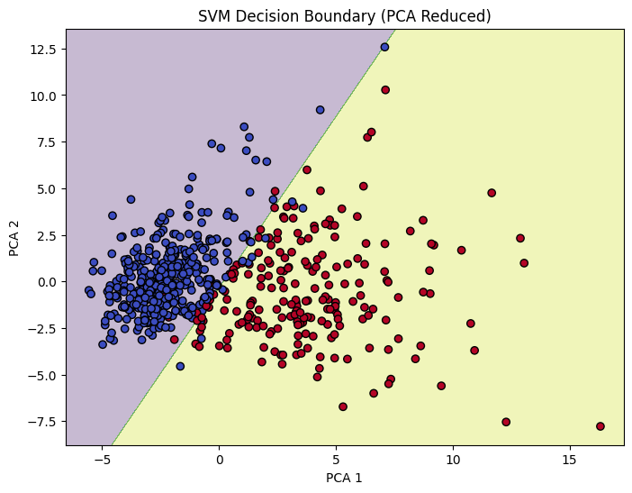

# ⚙️ Task 7: Support Vector Machines (SVM) Classification

This project implements the Support Vector Machines (SVM) algorithm using both **linear** and **RBF** kernels on the Breast Cancer dataset. The pipeline includes feature scaling, dimensionality reduction using PCA, hyperparameter tuning via Grid Search, and cross-validation for robust evaluation.

---

## 📂 Dataset

- **Name:** [Breast Cancer Dataset](https://www.kaggle.com/datasets/yasserh/breast-cancer-dataset)  
- **Source:** Kaggle  
- **Classes:** Malignant (1), Benign (0)  
- **Features:** Mean radius, texture, perimeter, area, smoothness, etc. (30 features)

---

## 🛠 Tools & Libraries

- Python (Colab)  
- scikit-learn  
- matplotlib  
- pandas  
- numpy  
- opendatasets  

---

## 📌 Steps Implemented

✅ Downloaded dataset using **opendatasets** from Kaggle  
✅ Preprocessed data and applied **StandardScaler**  
✅ Trained **SVM with linear and RBF kernels**  
✅ Reduced dimensions with **PCA** for 2D visualization  
✅ Plotted **decision boundary** using matplotlib  
✅ Tuned hyperparameters (**C**, **gamma**) with **GridSearchCV**  
✅ Evaluated performance using **cross-validation**  

---

## 📊 Results

- Both linear and RBF kernel models achieved high accuracy on the Breast Cancer dataset.
- Grid search revealed the best `C` and `gamma` values for RBF kernel.
- Cross-validation was used to confirm the generalizability of the selected model.
- A clear **decision boundary** was plotted after dimensionality reduction using PCA.

> The above plot visualizes how SVM separates malignant and benign samples in a reduced 2D space (via PCA).
